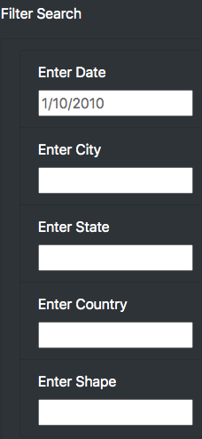

# UFO Website

# Creating 
We've been tasked with creating a webpage and dynamic table that will allow users to filter for multiple criteria at the same time.  In addition to date, the added filters include city, state, country, and shape.  

## Resources
- Software: Javascript, HTML

## Summary
As shown in the image below, a user can perform a search by entering a data, city, state, country, or shape as filter to only data that matches the criteria that is inputted. 

## Drawbacks
A dropdown for each filter would be more useful so that the user knows which entries can be used to filter the data.

## Recommendations

I would use dropdowns.  I would also make the refresh button clearer to restart the search.   

